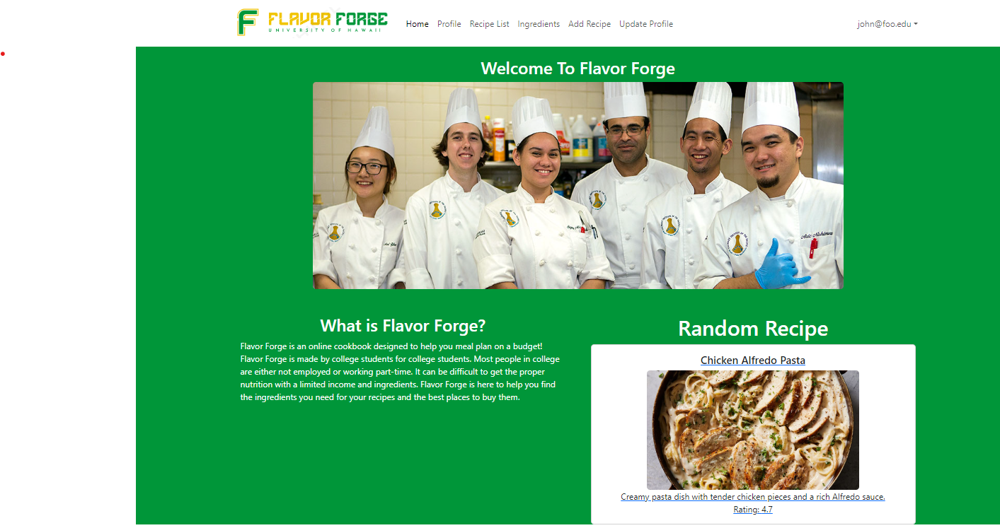
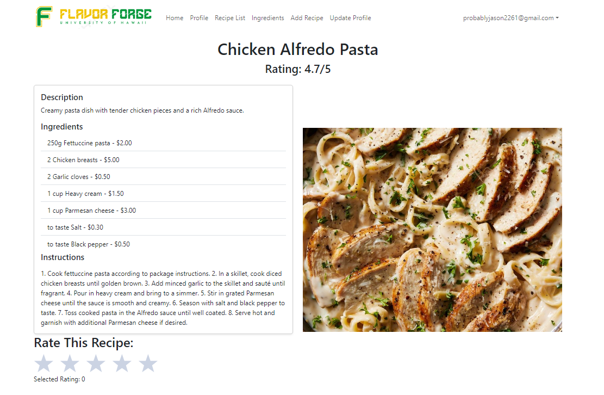
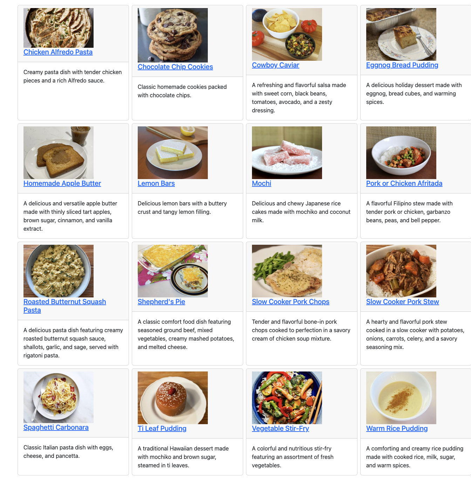
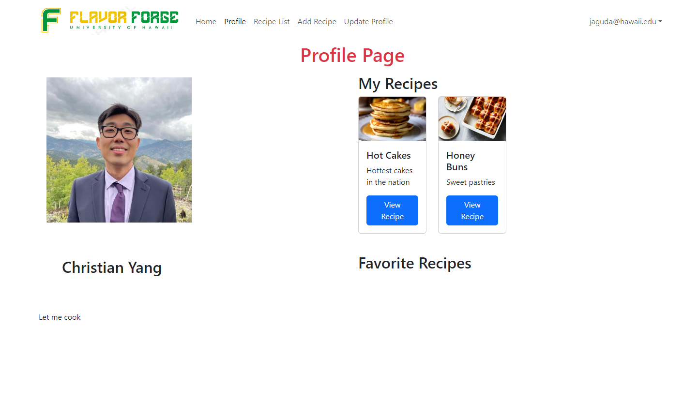

## Flavor Forge

FlavorForge stands at the forefront of a culinary evolution for college students. Beyond just sharing recipes, our innovative platform offers a vibrant community where culinary enthusiasts can connect, exchange tips, and inspire one another. We understand the challenges of limited resources and diverse dietary requirements, which is why FlavorForge is equipped with tools to customize recipes according to individual preferences and available ingredients. Our vision is to foster a culture of culinary creativity and self-sufficiency among students, empowering them to not only eat well but also enjoy the process of cooking amidst their busy academic schedules.

Here is the preview of our program:

## Home Page

## Recipe

## RecipeList

## Profile

## UpdateProfile

## Conclusion

In conclusion, my journey with FlavorForge has been nothing short of enlightening. Through this experience, I've come to appreciate the significance of teamwork in achieving collective goals. Working collaboratively with my peers, I've realized that pooling our diverse skills and perspectives not only enhances the quality of our work but also fosters a sense of camaraderie and mutual support.

During this project, my focus was primarily on the development and enhancement of the profile page feature. It was a rewarding challenge to refine the user experience and ensure that every detail catered to the needs and preferences of our community. Through this task, I've learned the importance of attention to detail and user-centric design principles in creating a seamless and enjoyable platform for our users.

Overall, my involvement with FlavorForge has not only honed my technical skills but has also taught me valuable lessons in collaboration, adaptability, and the power of innovation. I am excited to continue contributing to this dynamic project and to witness the impact of our collective efforts on revolutionizing the culinary landscape for college students everywhere.
